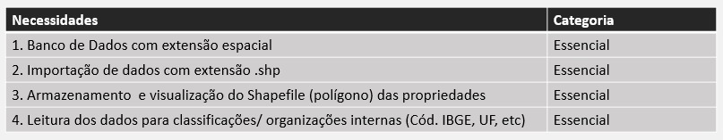
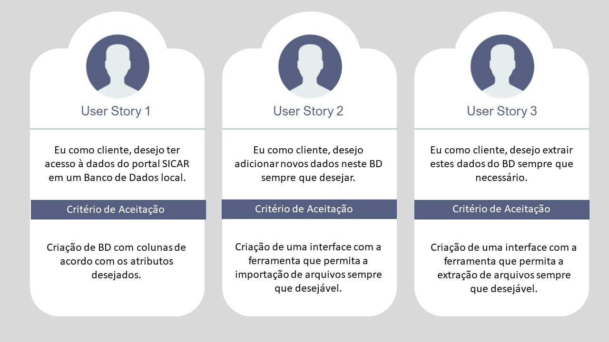



# Seja bem vindo ao   ConsultCAR

### Olá! Somos a equipe Tetris responsáveis pelo desenvolvimento da solução ConsultCar.

 

# O Time :woman: :man:

A equipe Tetris é composta pelos seguintes estudantes do 2º semestre de Banco de Dados pela FATEC de São José dos Campos:

- ***Product Owner***
  - [Alexia Karine Silva dos Santos](https://github.com/alexiakarine)
- ***Scrum Master***
  - [Jefferson Tavares de Araújo](https://github.com/jefferson-tavares-araujo)
- ***Team Dev :***
  - [Davi das Neves Machado](https://github.com/machadondavi)
  - [Gabriel Oliveira Sana](https://github.com/gabsana) 
  - [Nágella Nasser](https://github.com/nagellanasser) 
  - [Renata Garcia Nonato](https://github.com/RenataGarciaNonato)
  - [Valdiney José do Nascimento](https://github.com/Valdineynascimento)

 

#  ConsultCar

## Objetivo  

ConsultCar é uma ferramenta que tem o intuito de facilitar a importação, armazenamento e visualização de dados do Sistema Nacional de Cadastro Ambiental Rural.

 

## Requisitos funcionais :pencil:

- Banco de Dados com extensão espacial
- Importação e leitura de dados com extensão .shp
- Armazenamento do shapefile (polígono) da propriedade
- Leitura dos dados para classificações internas (Cód. IBGE, UF, etc)
  
 

## Funcionalidades :heavy_check_mark:

- Disponibilizar de forma organizada em tabela informações extraídas a partir da importação de arquivos adquiridos na plataforma do Sicar com extensão .shp 
 

## Público-alvo :dart:

Profissionais que tenham a necessidade de acesso de forma organizada aos dados do Cadastro  Ambiental Rural.

 

## Tecnologias utilizadas :computer:

- Git
- GitHub
- Banco de Dados: PostgreSQL || pgAdmin4 ou DBeaver
- Extensão espacial para o banco de dados: PostGIS

 

## Entregas :email:

- **SPRINT 1** :heavy_check_mark:
  - Definição da solução e suas funcionalidades
  - Desenvolvimento das _Users Stories_ do projeto
  - Idealização e desenvolvimento de protótipo [wireframe] da tela de importação de arquivos _**.CSV**_
    

- **SPRINT 2** :heavy_check_mark:
  - Correção no plano de desenvolvimento da aplicação
  - Modelagem do Banco de Dados - MER
  - Desenvolvimento do Banco de Dados
  - Importação e visualização do arquivo Shapefile (.shp), no BD
  

- **SPRINT 3** :heavy_check_mark:
  - Desenvolvimento do script de descompactação dos arquivos *.zip
  - Correção da modelagem do Banco de Dados - MER (conceitual e lógico)
  - Geração e visualização de logs de descompactação
  - Criação do Banco de Dados com extensão espacial
  - Estruturação do banco de dados para futura população de dados shapefile
  - Conexão entre aplicação e o Banco de Dados 
   

- **SPRINT 4** :heavy_check_mark:
  - Carga dos arquivos shapefiles no Banco de Dados
  - Ajustes de funcionalidades
   

## Product Backlog :page_with_curl:

- 
   

 

## Users Stories :chart_with_upwards_trend:

- 
   

 

## Modelagem Entidade-Relacionamento - MER :pencil2:

- **Modelo Conceitual**
  
   
  

- **Modelo Lógico**
  
   
  

## Wireframes :mortar_board:

- **01: Tela Inicial** *- atual*
  - 
  

  - *Tela Inicial Prevista - Sujeita a modificações* 
  - 
  

- **02: Diretorio de entrada com arquivos ainda compactados**
  - 
  

- **03: Conexão com o Banco de Dados**
  - 
  

- **04: Log informando as atividades do Sistema**
  - 
  

- **05: Diretorio de saída com arquivos descompactados**
  - 
  

- **06: Arquivos gerados**
  - 
  

### **Banco de Dados** :newspaper:
- **07: Banco de Dados criado com extensão espacial**
  - 
  

- **08: Estrutura das colunas no Banco de Dados** 
  - 
  

- **09: Script de importação dos dados para popular o banco de dados**
  - 
  

 
<!--
## Tela do Software :pager:

 
<!-- 

   

 
-->

